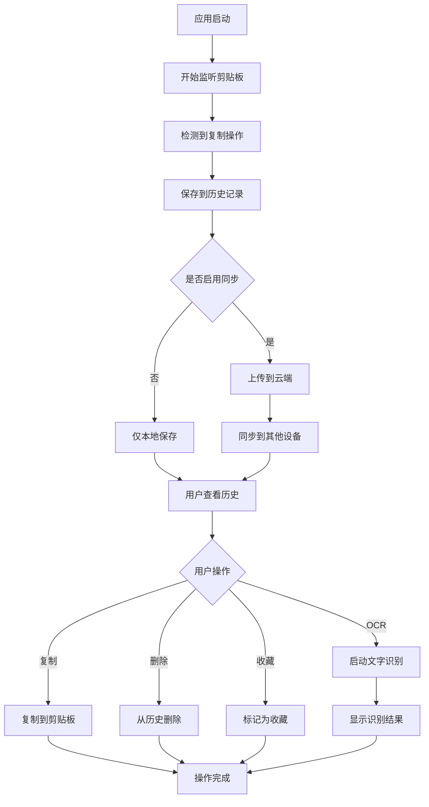

# xPaste 产品需求文档

## 1. 产品概述

xPaste 是一款跨平台的智能剪贴板管理工具，提供剪贴板历史记录、OCR 文字识别、跨设备同步等核心功能。产品采用现代化架构设计，支持 Windows、macOS、Linux 三大平台，为用户提供高效便捷的剪贴板管理体验。

产品旨在解决用户在多设备工作环境中的剪贴板数据管理痛点，通过智能化的数据处理和无缝的跨设备同步，显著提升用户的工作效率和数据管理体验。

## 2. 核心功能

### 2.1 用户角色

| 角色 | 注册方式 | 核心权限 |
|------|----------|----------|
| 普通用户 | 本地安装使用 | 可使用本地剪贴板管理、OCR识别等基础功能 |
| 同步用户 | 账号注册登录 | 可使用跨设备同步、云端备份等高级功能 |

### 2.2 功能模块

我们的 xPaste 产品包含以下主要页面：

1. **主界面**：剪贴板历史列表、搜索筛选、快速操作面板
2. **设置页面**：应用配置、同步设置、快捷键配置、主题选择
3. **同步管理页面**：设备管理、同步状态、冲突解决
4. **OCR 结果页面**：图片文字识别结果展示、编辑保存

### 2.3 页面详情

| 页面名称 | 模块名称 | 功能描述 |
|----------|----------|----------|
| 主界面 | 历史列表 | 显示剪贴板历史记录，支持文本、图片、文件等多种类型，按时间倒序排列 |
| 主界面 | 搜索筛选 | 提供关键词搜索、类型筛选、时间范围筛选、收藏筛选等功能 |
| 主界面 | 快速操作 | 支持一键复制、删除、收藏、备注、OCR识别等操作 |
| 主界面 | 实时监听 | 自动监听系统剪贴板变化，实时更新历史记录 |
| 设置页面 | 基础配置 | 设置启动选项、监听开关、历史记录数量限制、数据清理策略 |
| 设置页面 | 快捷键配置 | 自定义全局快捷键，包括显示/隐藏窗口、快速粘贴等 |
| 设置页面 | 主题设置 | 支持明暗主题切换、自定义颜色方案、界面布局调整 |
| 设置页面 | 同步配置 | 配置同步服务器、登录账号、同步策略、冲突处理方式 |
| 同步管理页面 | 设备列表 | 显示已注册设备、设备状态、最后同步时间 |
| 同步管理页面 | 同步状态 | 实时显示同步进度、错误信息、网络状态 |
| 同步管理页面 | 冲突解决 | 处理同步冲突、选择保留版本、合并数据 |
| OCR 结果页面 | 识别结果 | 显示图片 OCR 识别的文字内容，支持多语言识别 |
| OCR 结果页面 | 结果编辑 | 允许用户编辑识别结果、添加备注、保存到历史 |

## 3. 核心流程

### 普通用户流程
用户安装应用后，应用自动开始监听系统剪贴板。当用户复制内容时，应用自动捕获并保存到历史记录。用户可通过快捷键或托盘图标打开主界面，浏览历史记录并进行复制、删除、收藏等操作。对于图片内容，用户可选择进行 OCR 识别获取文字内容。

### 同步用户流程
用户首先注册账号并登录，然后在设置中配置同步选项。应用会自动将本地数据同步到云端，并从云端拉取其他设备的数据。当检测到冲突时，用户可在同步管理页面选择处理方式。用户可在多个设备间无缝切换，享受一致的剪贴板体验。

## 4. 用户界面设计

### 4.1 设计风格

- **主色调**：#2563EB (蓝色) 作为主色，#F8FAFC (浅灰) 作为背景色
- **辅助色**：#10B981 (绿色) 表示成功，#EF4444 (红色) 表示错误，#F59E0B (橙色) 表示警告
- **按钮样式**：圆角矩形设计，支持悬停和点击状态变化
- **字体**：系统默认字体，主要文字 14px，标题 16-20px，辅助文字 12px
- **布局风格**：卡片式设计，顶部导航栏，左侧功能面板，主内容区域
- **图标风格**：使用 Lucide React 图标库，线性风格，保持一致性

### 4.2 页面设计概览

| 页面名称 | 模块名称 | UI 元素 |
|----------|----------|----------|
| 主界面 | 历史列表 | 卡片式布局，每项包含类型图标、内容预览、时间戳、操作按钮。支持虚拟滚动优化性能 |
| 主界面 | 搜索筛选 | 顶部搜索框，下拉筛选器，标签式快速筛选。使用 #F3F4F6 背景色，圆角设计 |
| 主界面 | 快速操作 | 悬浮操作按钮，右键菜单，快捷键提示。使用半透明背景，动画过渡效果 |
| 设置页面 | 配置面板 | 左侧导航菜单，右侧配置表单。使用分组布局，清晰的视觉层次 |
| 同步管理页面 | 设备列表 | 表格式布局，设备图标，状态指示器。在线设备使用绿色标识，离线设备使用灰色 |
| OCR 结果页面 | 结果展示 | 左右分栏布局，左侧原图预览，右侧文字结果。支持文字选择和复制 |

### 4.3 响应式设计

产品主要面向桌面端用户，采用桌面优先的设计策略。最小窗口尺寸为 800x600 像素，支持窗口缩放和全屏模式。界面元素采用相对单位设计，确保在不同分辨率下的良好显示效果。支持键盘导航和快捷键操作，提升用户操作效率。