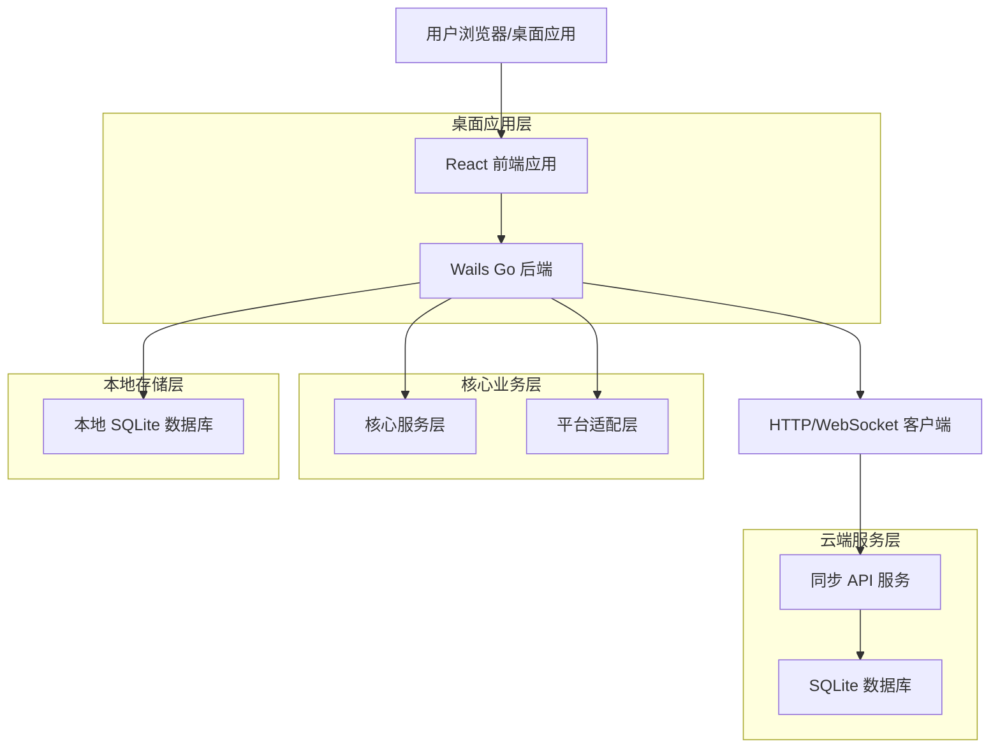
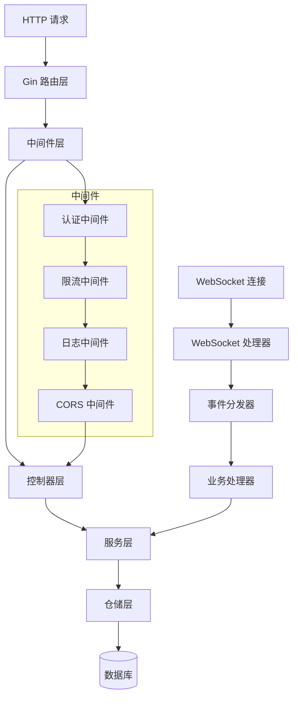
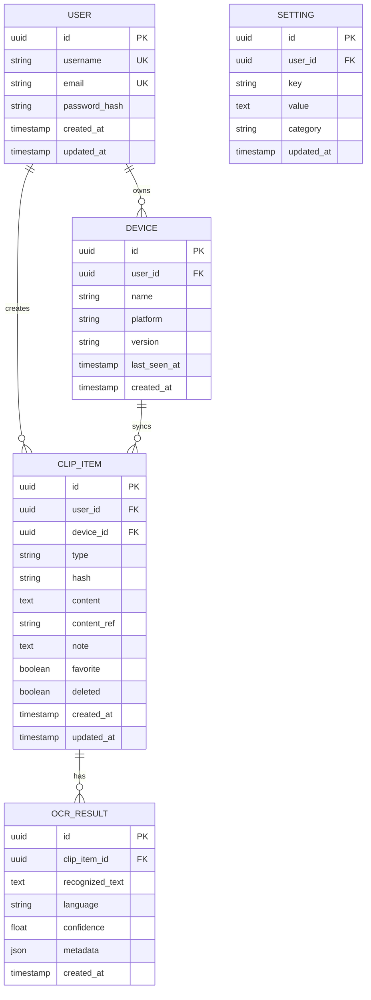

# xPaste 技术架构文档

## 1. 架构设计



## 2. 技术描述

* **前端**: React\@18 + TypeScript + TailwindCSS + Zustand + Vite

* **桌面后端**: Wails v2 + Go 1.21

* **同步服务**: Go 1.21 + Gin + WebSocket

* **本地数据库**: SQLite + GORM

* **云端数据库**: SQLite + GORM

* **构建工具**: Vite + Go modules + pnpm workspace

## 3. 路由定义

| 路由        | 用途                    |
| --------- | --------------------- |
| /         | 主界面，显示剪贴板历史记录和搜索功能    |
| /settings | 设置页面，包含应用配置、快捷键、主题等设置 |
| /sync     | 同步管理页面，显示设备列表和同步状态    |
| /ocr/:id  | OCR 结果页面，显示图片识别的文字内容  |

## 4. API 定义

### 4.1 桌面应用 Go 服务接口

**剪贴板服务**

```go
type ClipboardService interface {
    // 获取历史记录
    GetHistory(filter HistoryFilter) ([]ClipItem, error)
    // 添加剪贴板项
    AddItem(item ClipItem) error
    // 删除剪贴板项
    DeleteItem(id string) error
    // 更新剪贴板项
    UpdateItem(item ClipItem) error
    // 开始监听剪贴板
    StartWatching() error
    // 停止监听剪贴板
    StopWatching() error
}
```

**同步服务**

```go
type SyncService interface {
    // 登录
    Login(username, password string) (*AuthResult, error)
    // 注册设备
    RegisterDevice(deviceInfo DeviceInfo) (*Device, error)
    // 拉取远程数据
    PullClips(since time.Time) ([]ClipItem, error)
    // 推送本地数据
    PushClips(items []ClipItem) (*SyncResult, error)
    // 获取同步状态
    GetSyncStatus() (*SyncStatus, error)
}
```

**OCR 服务**

```go
type OcrService interface {
    // 识别图片文字
    RecognizeText(imagePath string, language string) (*OcrResult, error)
    // 获取支持的语言列表
    GetSupportedLanguages() ([]string, error)
}
```

### 4.2 同步 API 服务接口

**用户认证**

```
POST /api/auth/login
```

请求参数:

| 参数名      | 参数类型   | 是否必需 | 描述  |
| -------- | ------ | ---- | --- |
| username | string | true | 用户名 |
| password | string | true | 密码  |

响应参数:

| 参数名         | 参数类型    | 描述       |
| ----------- | ------- | -------- |
| success     | boolean | 登录是否成功   |
| token       | string  | JWT 访问令牌 |
| expires\_at | string  | 令牌过期时间   |

示例:

```json
{
  "username": "user@example.com",
  "password": "password123"
}
```

**设备注册**

```
POST /api/devices/register
```

请求参数:

| 参数名      | 参数类型   | 是否必需 | 描述                         |
| -------- | ------ | ---- | -------------------------- |
| name     | string | true | 设备名称                       |
| platform | string | true | 平台类型 (windows/macos/linux) |
| version  | string | true | 应用版本                       |

响应参数:

| 参数名            | 参数类型   | 描述     |
| -------------- | ------ | ------ |
| device\_id     | string | 设备唯一标识 |
| name           | string | 设备名称   |
| registered\_at | string | 注册时间   |

**剪贴板数据同步**

```
GET /api/clips/pull?since={timestamp}
```

响应参数:

| 参数名          | 参数类型        | 描述       |
| ------------ | ----------- | -------- |
| clips        | ClipItem\[] | 剪贴板项列表   |
| has\_more    | boolean     | 是否还有更多数据 |
| next\_cursor | string      | 下一页游标    |

```
POST /api/clips/push
```

请求参数:

| 参数名   | 参数类型        | 是否必需 | 描述         |
| ----- | ----------- | ---- | ---------- |
| clips | ClipItem\[] | true | 要推送的剪贴板项列表 |

响应参数:

| 参数名        | 参数类型      | 描述        |
| ---------- | --------- | --------- |
| accepted   | number    | 成功接受的项目数量 |
| duplicates | number    | 重复的项目数量   |
| errors     | string\[] | 错误信息列表    |

### 4.3 WebSocket 事件定义

**客户端 -> 服务端事件**

* `device.heartbeat`: 设备心跳

* `clip.subscribe`: 订阅剪贴板更新

* `clip.unsubscribe`: 取消订阅

**服务端 -> 客户端事件**

* `clip.created`: 新剪贴板项创建

* `clip.updated`: 剪贴板项更新

* `clip.deleted`: 剪贴板项删除

* `device.online`: 设备上线

* `device.offline`: 设备离线

## 5. 服务架构图



## 6. 数据模型

### 6.1 数据模型定义



### 6.2 数据定义语言

**用户表 (users)**

```sql
-- 创建用户表
CREATE TABLE users (
    id TEXT PRIMARY KEY DEFAULT (lower(hex(randomblob(4))) || '-' || lower(hex(randomblob(2))) || '-4' || substr(lower(hex(randomblob(2))),2) || '-' || substr('89ab',abs(random()) % 4 + 1, 1) || substr(lower(hex(randomblob(2))),2) || '-' || lower(hex(randomblob(6)))),
    username TEXT UNIQUE NOT NULL,
    email TEXT UNIQUE NOT NULL,
    password_hash TEXT NOT NULL,
    created_at DATETIME DEFAULT CURRENT_TIMESTAMP,
    updated_at DATETIME DEFAULT CURRENT_TIMESTAMP
);

-- 创建索引
CREATE INDEX idx_users_username ON users(username);
CREATE INDEX idx_users_email ON users(email);
```

**设备表 (devices)**

```sql
-- 创建设备表
CREATE TABLE devices (
    id TEXT PRIMARY KEY DEFAULT (lower(hex(randomblob(4))) || '-' || lower(hex(randomblob(2))) || '-4' || substr(lower(hex(randomblob(2))),2) || '-' || substr('89ab',abs(random()) % 4 + 1, 1) || substr(lower(hex(randomblob(2))),2) || '-' || lower(hex(randomblob(6)))),
    user_id TEXT NOT NULL REFERENCES users(id) ON DELETE CASCADE,
    name TEXT NOT NULL,
    platform TEXT NOT NULL CHECK (platform IN ('windows', 'macos', 'linux')),
    version TEXT NOT NULL,
    last_seen_at DATETIME DEFAULT CURRENT_TIMESTAMP,
    created_at DATETIME DEFAULT CURRENT_TIMESTAMP
);

-- 创建索引
CREATE INDEX idx_devices_user_id ON devices(user_id);
CREATE INDEX idx_devices_last_seen ON devices(last_seen_at DESC);
```

**剪贴板项表 (clip\_items)**

```sql
-- 创建剪贴板项表
CREATE TABLE clip_items (
    id TEXT PRIMARY KEY DEFAULT (lower(hex(randomblob(4))) || '-' || lower(hex(randomblob(2))) || '-4' || substr(lower(hex(randomblob(2))),2) || '-' || substr('89ab',abs(random()) % 4 + 1, 1) || substr(lower(hex(randomblob(2))),2) || '-' || lower(hex(randomblob(6)))),
    user_id TEXT NOT NULL REFERENCES users(id) ON DELETE CASCADE,
    device_id TEXT NOT NULL REFERENCES devices(id) ON DELETE CASCADE,
    type TEXT NOT NULL CHECK (type IN ('text', 'image', 'file', 'html')),
    hash TEXT NOT NULL,
    content TEXT,
    content_ref TEXT,
    note TEXT,
    favorite INTEGER DEFAULT 0,
    deleted INTEGER DEFAULT 0,
    created_at DATETIME DEFAULT CURRENT_TIMESTAMP,
    updated_at DATETIME DEFAULT CURRENT_TIMESTAMP
);

-- 创建索引
CREATE INDEX idx_clip_items_user_id ON clip_items(user_id);
CREATE INDEX idx_clip_items_device_id ON clip_items(device_id);
CREATE INDEX idx_clip_items_hash ON clip_items(hash);
CREATE INDEX idx_clip_items_created_at ON clip_items(created_at DESC);
CREATE INDEX idx_clip_items_type ON clip_items(type);
CREATE INDEX idx_clip_items_favorite ON clip_items(favorite) WHERE favorite = 1;
CREATE INDEX idx_clip_items_deleted ON clip_items(deleted) WHERE deleted = 0;
```

**OCR 结果表 (ocr\_results)**

```sql
-- 创建 OCR 结果表
CREATE TABLE ocr_results (
    id TEXT PRIMARY KEY DEFAULT (lower(hex(randomblob(4))) || '-' || lower(hex(randomblob(2))) || '-4' || substr(lower(hex(randomblob(2))),2) || '-' || substr('89ab',abs(random()) % 4 + 1, 1) || substr(lower(hex(randomblob(2))),2) || '-' || lower(hex(randomblob(6)))),
    clip_item_id TEXT NOT NULL REFERENCES clip_items(id) ON DELETE CASCADE,
    recognized_text TEXT NOT NULL,
    language TEXT NOT NULL DEFAULT 'auto',
    confidence REAL DEFAULT 0.0,
    metadata TEXT,
    created_at DATETIME DEFAULT CURRENT_TIMESTAMP
);

-- 创建索引
CREATE INDEX idx_ocr_results_clip_item_id ON ocr_results(clip_item_id);
CREATE INDEX idx_ocr_results_language ON ocr_results(language);
```

**设置表 (settings)**

```sql
-- 创建设置表
CREATE TABLE settings (
    id TEXT PRIMARY KEY DEFAULT (lower(hex(randomblob(4))) || '-' || lower(hex(randomblob(2))) || '-4' || substr(lower(hex(randomblob(2))),2) || '-' || substr('89ab',abs(random()) % 4 + 1, 1) || substr(lower(hex(randomblob(2))),2) || '-' || lower(hex(randomblob(6)))),
    user_id TEXT REFERENCES users(id) ON DELETE CASCADE,
    key TEXT NOT NULL,
    value TEXT NOT NULL,
    category TEXT DEFAULT 'general',
    updated_at DATETIME DEFAULT CURRENT_TIMESTAMP
);

-- 创建索引
CREATE INDEX idx_settings_user_id ON settings(user_id);
CREATE INDEX idx_settings_key ON settings(key);
CREATE UNIQUE INDEX idx_settings_user_key ON settings(user_id, key);

-- 初始化数据
INSERT INTO settings (key, value, category) VALUES
('max_history_items', '1000', 'storage'),
('auto_cleanup_days', '30', 'storage'),
('enable_ocr', 'true', 'features'),
('ocr_language', 'auto', 'features'),
('sync_interval', '300', 'sync'),
('enable_notifications', 'true', 'ui');
```

## 7. 核心类型定义

### 7.1 Go 类型定义

```go
// ClipItem 剪贴板项
type ClipItem struct {
    ID         string    `json:"id" gorm:"primaryKey;type:uuid;default:gen_random_uuid()"`
    UserID     *string   `json:"user_id,omitempty" gorm:"type:uuid"`
    DeviceID   string    `json:"device_id" gorm:"type:uuid;not null"`
    Type       string    `json:"type" gorm:"type:varchar(20);not null"`
    Hash       string    `json:"hash" gorm:"type:varchar(64);not null"`
    Content    *string   `json:"content,omitempty" gorm:"type:text"`
    ContentRef *string   `json:"content_ref,omitempty" gorm:"type:varchar(500)"`
    Note       *string   `json:"note,omitempty" gorm:"type:text"`
    Favorite   bool      `json:"favorite" gorm:"default:false"`
    Deleted    bool      `json:"deleted" gorm:"default:false"`
    CreatedAt  time.Time `json:"created_at" gorm:"autoCreateTime"`
    UpdatedAt  time.Time `json:"updated_at" gorm:"autoUpdateTime"`
}

// Device 设备信息
type Device struct {
    ID         string    `json:"id" gorm:"primaryKey;type:uuid;default:gen_random_uuid()"`
    UserID     *string   `json:"user_id,omitempty" gorm:"type:uuid"`
    Name       string    `json:"name" gorm:"type:varchar(100);not null"`
    Platform   string    `json:"platform" gorm:"type:varchar(20);not null"`
    Version    string    `json:"version" gorm:"type:varchar(20);not null"`
    LastSeenAt time.Time `json:"last_seen_at" gorm:"autoUpdateTime"`
    CreatedAt  time.Time `json:"created_at" gorm:"autoCreateTime"`
}

// OcrResult OCR 识别结果
type OcrResult struct {
    ID              string                 `json:"id" gorm:"primaryKey;type:uuid;default:gen_random_uuid()"`
    ClipItemID      string                 `json:"clip_item_id" gorm:"type:uuid;not null"`
    RecognizedText  string                 `json:"recognized_text" gorm:"type:text;not null"`
    Language        string                 `json:"language" gorm:"type:varchar(10);default:'auto'"`
    Confidence      float64                `json:"confidence" gorm:"default:0.0"`
    Metadata        map[string]interface{} `json:"metadata,omitempty" gorm:"type:jsonb"`
    CreatedAt       time.Time              `json:"created_at" gorm:"autoCreateTime"`
}

// SyncStatus 同步状态
type SyncStatus struct {
    IsConnected    bool      `json:"is_connected"`
    LastSyncAt     time.Time `json:"last_sync_at"`
    PendingUploads int       `json:"pending_uploads"`
    PendingDownloads int     `json:"pending_downloads"`
    ErrorMessage   *string   `json:"error_message,omitempty"`
}
```

### 7.2 TypeScript 类型定义

```typescript
// 与 Go 类型对应的 TypeScript 定义
export interface ClipItem {
  id: string;
  user_id?: string;
  device_id: string;
  type: 'text' | 'image' | 'file' | 'html';
  hash: string;
  content?: string;
  content_ref?: string;
  note?: string;
  favorite: boolean;
  deleted: boolean;
  created_at: string;
  updated_at: string;
}

export interface Device {
  id: string;
  user_id?: string;
  name: string;
  platform: 'windows' | 'macos' | 'linux';
  version: string;
  last_seen_at: string;
  created_at: string;
}

export interface OcrResult {
  id: string;
  clip_item_id: string;
  recognized_text: string;
  language: string;
  confidence: number;
  metadata?: Record<string, any>;
  created_at: string;
}

export interface SyncStatus {
  is_connected: boolean;
  last_sync_at: string;
  pending_uploads: number;
  pending_downloads: number;
  error_message?: string;
}
```

## 8. 部署架构

### 8.1 本地部署

* 桌面应用：单文件可执行程序，包含所有依赖

* 数据存储：用户数据目录下的 SQLite 数据库

* 配置文件：JSON 格式，支持热重载

### 8.2 云端部署

* 同步服务：Docker 容器化部署，单机部署

* 数据库：SQLite 文件数据库，轻量级存储

* 负载均衡：Nginx 反向代理，SSL 终止（可选）

### 8.3 监控与日志

* 应用监控：Prometheus + Grafana

* 日志收集：ELK Stack (Elasticsearch + Logstash + Kibana)

* 错误追踪：Sentry 集成

* 性能分析：Go pprof 工具

